# TerminalTutor (tt)

> Professor de CLI inteligente que vive no seu shell, powered by Google Gemini.

[](LICENSE)
[](https://isocpp.org/)
[](https://ai.google.dev/)

---

## Funcionalidades

| Funcionalidade | Descricao |
|----------------|-----------|
| Streaming Response | Respostas em tempo real via libcurl SSE |
| --run Mode | Executa comandos para tarefas solicitadas |
| Conversas Persistentes | Sessoes nomeadas com contexto entre interacoes |
| Console Interativo | REPL dedicado para uso continuo |
| Deteccao de Perigo | Blocklist extensiva + confirmacao para comandos destrutivos |
| Token Counter | Monitora uso de tokens nas sessoes |
| ELI5 Mode | Explicacoes para iniciantes |
| What-If Mode | Simula comandos antes de executar |
| Armazenamento Seguro | API key no GNOME Keyring |

---

## Arquitetura


### Fluxo de Execucao (--run)

```mermaid
sequenceDiagram
    participant U as Usuario
    participant T as tt CLI
    participant G as Gemini API
    participant S as Shell
    
    U->>T: tt --run "achar maior arquivo"
    T->>G: getCommandForTask(query)
    G-->>T: {command: "ls -lS | head -1", explanation: "..."}
    T->>T: Check blocklist
    T->>U: 💡 Explicacao
    T->>U: $ ls -lS | head -1
    T->>S: executeAndCapture()
    S-->>T: output
    T->>U: [resultado]
    T->>T: Save to session
```



---

## Requisitos

### Software
- Linux (Ubuntu 22.04+ recomendado)
- CMake 3.20+
- GCC 11+ ou Clang 14+
- OpenSSL (`libssl-dev`)
- libcurl (`libcurl4-openssl-dev`) - para streaming
- libsecret (`libsecret-1-dev`)
- Chave de API do [Google AI Studio](https://aistudio.google.com/apikey)

### Instalar Dependencias

```bash
# Ubuntu/Debian
sudo apt update
sudo apt install -y build-essential cmake git libssl-dev libcurl4-openssl-dev libsecret-1-dev pkg-config
```

---

## Inicio Rapido

### 1. Clonar e Compilar

```bash
git clone https://github.com/lucianommartins/terminalTutor.git
cd terminalTutor/terminal-tutor
mkdir build && cd build
cmake .. -DCMAKE_BUILD_TYPE=Release
make -j$(nproc)
```

### 2. Configurar API Key

```bash
./tt --auth
# Cole sua API key (input oculto)
# Validating API key...
# API key validated and saved!
```

A chave fica armazenada de forma segura no GNOME Keyring.

### 3. Instalar (Opcional)

```bash
sudo make install    # Instala em /usr/local/bin
sudo make uninstall  # Remove do sistema
```

---

## Uso

### Modo Streaming (Default)

Perguntas, explicacoes e conversas aparecem em tempo real:

```bash
tt "o que e um processo no Linux?"
# Texto aparece em tempo real conforme o modelo gera...

tt "escreva um poema sobre programacao"
# Streaming visual enquanto gera...
```

### Modo Execucao (--run)

Use `--run` para executar comandos:

```bash
tt --run "achar o maior arquivo neste diretorio"

# 💡 Lista arquivos ordenados por tamanho
# $ ls -lS | head -n 1
# -rw-r--r-- 1 user user 15M Jan 18 video.mp4

tt --run "parar o servidor na porta 3000"

# 💡 Encontra e mata o processo
# $ kill $(lsof -t -i:3000)
```

### Sessoes Persistentes

```bash
# Criar/usar sessao
tt --session projeto "como eu compilo isso?"

# O modelo lembra do contexto anterior
tt --session projeto "e como eu rodo os testes?"

# Listar sessoes
tt --session list

# Deletar sessao
tt --session delete projeto
```

### Console Interativo

```bash
# Console simples
tt --console

# Console com sessao persistente
tt --session projeto --console
```

Exemplo de uso:
```
TerminalTutor Interactive Console
Session: projeto
Type 'exit' or 'quit' to leave, 'clear' to clear session

tt > achar maior arquivo
💡 Lista arquivos por tamanho
$ ls -lS | head -n 1

tt > porque o resultado veio vazio?
💡 O diretorio pode estar vazio...

tt > exit
Goodbye!
```

### Explicar Comando

```bash
tt explain "find . -type f -name '*.cpp' -exec grep -l TODO {} \;"

# Esse comando:
# 1. Busca arquivos (-type f) com extensao .cpp
# 2. Executa grep em cada um para encontrar TODO
# 3. Lista apenas os arquivos que contem a palavra
```

### Modo ELI5 (Explain Like I'm 5)

```bash
tt eli5 "chmod 755 script.sh"

# Imagina que o arquivo e como um brinquedo. O chmod e como
# colocar etiquetas dizendo quem pode brincar com ele...
```

### Modo What-If (Simulacao)

```bash
tt whatif "rm -rf ./node_modules"

# ATENCAO: Este comando e potencialmente destrutivo!
# Simulacao: Ira remover recursivamente o diretorio...
```

### Configuracao

```bash
tt --config list              # Mostra configuracao atual
tt --config reset             # Volta ao default
tt --config model=gemini-pro  # Muda o modelo
tt --config language=en       # Muda idioma das respostas
```

---

## Seguranca

### Blocklist de Comandos Perigosos

Comandos que requerem confirmacao explicita:

| Categoria | Exemplos |
|-----------|----------|
| Exclusao | `rm`, `rmdir`, `shred` |
| Sistema | `shutdown`, `reboot`, `halt` |
| Disco | `mkfs`, `dd`, `fdisk` |
| Privilegios | `sudo`, `chmod 777` |
| Processos | `kill -9`, `killall`, `pkill` |
| Rede | `iptables -F`, `ufw disable` |

```bash
tt "parar o processo nginx"

# ⚠️  WARNING: POTENTIALLY DANGEROUS COMMAND!
# This command may cause irreversible damage.
# Command: sudo systemctl stop nginx
# Type 'yes' to confirm execution: _
```

### Monitoramento de Tokens

Para sessoes longas, o sistema monitora o uso de tokens:

- **< 50%**: Nenhuma mensagem
- **50-80%**: `💡 ATTENTION: Session usando X% do token limit`
- **> 80%**: `⚠️ WARNING: Considere criar nova sessao`

---

## Estrutura do Projeto

```
terminal-tutor/
├── CMakeLists.txt
├── README.md
├── include/tt/
│   ├── CommandParser.hpp
│   ├── GeminiClient.hpp      # Smart Query, Sessions, Token Counter
│   ├── ExplainerEngine.hpp
│   └── Simulator.hpp
├── src/
│   ├── main.cpp              # CLI entry point
│   ├── CommandParser.cpp
│   ├── GeminiClient.cpp
│   ├── ExplainerEngine.cpp
│   └── Simulator.cpp
└── tests/
    └── test_command_parser.cpp
```

---

## Desenvolvimento

### Compilar com Debug

```bash
cmake .. -DCMAKE_BUILD_TYPE=Debug
make -j$(nproc)
```

### Executar Testes

```bash
cd build
ctest --output-on-failure
```

### Limpar Build

```bash
make clean
```

---

## Status de Implementacao

| Componente | Status |
|------------|--------|
| Core CLI | ✅ Completo |
| Gemini Integration | ✅ Completo |
| Smart Query (Auto Execute/Explain) | ✅ Completo |
| Session Management | ✅ Completo |
| Dangerous Command Detection | ✅ Completo |
| Token Counter | ✅ Completo |
| Secure Storage (Keyring) | ✅ Completo |
| ELI5 Mode | ✅ Completo |
| What-If Simulator | ✅ Completo |

---

## Licenca

Apache 2.0 - Veja [LICENSE](LICENSE)

---

## Agradecimentos

- [Google Gemini](https://ai.google.dev/) - LLM API
- [cpp-httplib](https://github.com/yhirose/cpp-httplib) - HTTP Client
- [nlohmann/json](https://github.com/nlohmann/json) - JSON Library
- [libsecret](https://wiki.gnome.org/Projects/Libsecret) - Secure Storage
