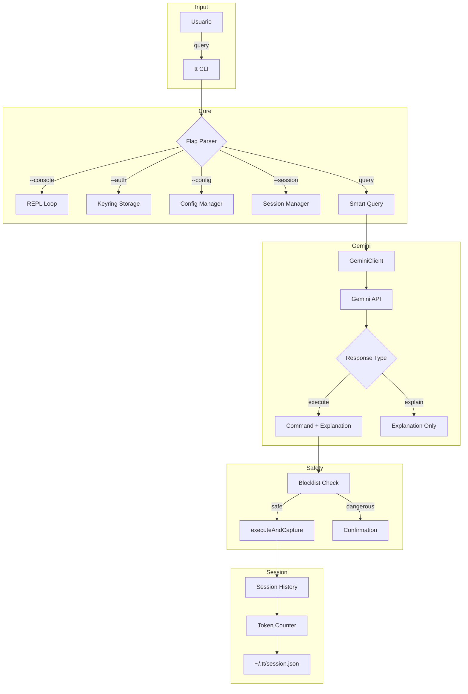
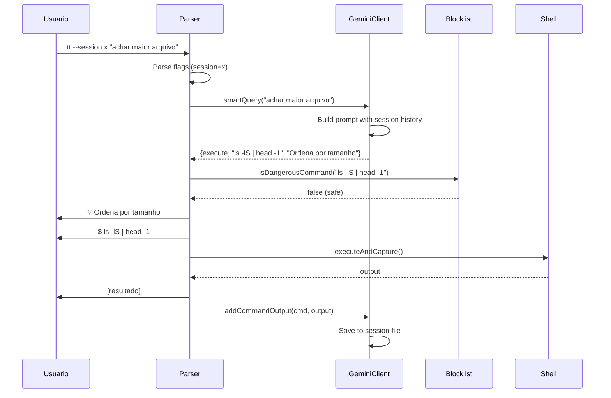

# Technical Design Document (TDD): TerminalTutor

**Status:** Production Ready  
**Versao:** 2.0  
**Linguagem:** C++20  
**Target:** Linux x86_64  
**Ultima Atualizacao:** 2026-01-18

---

## 1. Visao Geral

O **TerminalTutor (tt)** e uma ferramenta CLI inteligente que transforma o terminal em um ambiente de aprendizado interativo. Utiliza a Gemini API com **Smart Query** para detectar automaticamente se deve executar comandos ou explicar conceitos.

### Principais Diferenciais

- **Smart Query**: Detecta automaticamente se deve executar ou explicar
- **Sessoes Persistentes**: Contexto mantido entre interacoes
- **Console Interativo**: REPL dedicado para uso continuo
- **Seguranca Robusta**: Blocklist extensiva + confirmacao para comandos perigosos
- **Token Monitoring**: Alerta quando sessoes estao muito grandes

---

## 2. Arquitetura do Sistema



---

## 3. Componentes

### 3.1. Streaming Engine (generateContentStreaming)

Modo padrao do sistema. Usa libcurl com CURLOPT_WRITEFUNCTION para output em tempo real:

```cpp
// Callback chamado a cada chunk SSE recebido
static size_t curlWriteCallback(char* ptr, size_t size, size_t nmemb, void* userdata);

// Parseia SSE events e chama callback do usuario com texto
ctx->callback(chunk);  // Output imediato
```

**Endpoint:** `POST /v1beta/models/{model}:streamGenerateContent?alt=sse`

### 3.2. Run Mode (getCommandForTask)

Ativado com `--run`, retorna JSON com comando para executar:

```json
{"command": "ls -lS | head -1", "explanation": "Ordena por tamanho"}
```

**Fluxo:**
1. Prompt pede JSON com comando + explicacao
2. Parse JSON, extrai comando
3. Verifica blocklist
4. Executa e captura output

### 3.3. Session Manager

Sessoes nomeadas persistentes em `~/.tt/<name>.json`:

- Historico de conversas (role: user/model)
- Output de comandos executados para contexto
- Permissoes 600 para seguranca

### 3.4. Token Counter

Usa endpoint `countTokens` da Gemini API:

```cpp
POST /v1beta/models/{model}:countTokens
{"contents": [session_history]}
// Response: {"totalTokens": 12345}
```

**Thresholds de Alerta:**
- < 50%: Silencioso
- 50-80%: ATTENTION (amarelo)
- > 80%: WARNING (vermelho)

### 3.5. Dangerous Command Detector

Blocklist local (sem API) com duas listas:

**Comandos Exatos:**
```cpp
"rm", "rmdir", "shred", "sudo", "shutdown", "reboot",
"mkfs", "dd", "fdisk", "chmod 777", "kill -9", "pkill"
```

**Padroes:**
```cpp
"> /dev/", "> /etc/", "| sh", ":(){ ", "fork bomb"
```

### 3.6. Console Mode (REPL)

Loop interativo com:
- Prompt `tt > `
- Comandos especiais: `exit`, `quit`, `clear`
- Suporte a `--session` e `--run`
- Streaming por padrao, --run para comandos

---

## 4. Dependencias

| Biblioteca | Versao | Proposito |
|------------|--------|-----------|
| cpp-httplib | v0.15.3 | HTTP/HTTPS client |
| nlohmann_json | v3.11.3 | JSON parsing |
| libcurl | System | Streaming SSE responses |
| OpenSSL | System | HTTPS encryption |
| libsecret | System | GNOME Keyring storage |

---

## 5. Modos de Operacao

| Modo | Comando | Descricao |
|------|---------|-----------|
| Smart Query | `tt "query"` | Auto-detecta execute/explain |
| Explain | `tt explain cmd` | Explica comando em detalhes |
| ELI5 | `tt eli5 cmd` | Explicacao para iniciantes |
| What-If | `tt whatif cmd` | Simula antes de executar |
| Console | `tt --console` | REPL interativo |
| Session | `tt --session name` | Conversa persistente |

---

## 6. Armazenamento

### API Key e Configuracao

Armazenadas no GNOME Keyring via libsecret:
- `api_key`: Chave da Gemini API
- `model`: Modelo (default: gemini-3-flash-preview)
- `language`: Idioma das respostas (default: en)

### Sessoes

Diretorio: `~/.tt/`
Formato: `<session_name>.json`
Permissoes: 600

```json
{
  "history": [
    {"role": "user", "parts": [{"text": "query"}]},
    {"role": "model", "parts": [{"text": "response"}]}
  ]
}
```

---

## 7. Fluxo de Execucao



---

## 8. Tratamento de Erros

| Erro | Tratamento |
|------|------------|
| API key invalida | Mensagem + sugerir `tt --auth` |
| Timeout de rede | 60s read timeout, mensagem amigavel |
| Modelo invalido | Validacao antes de salvar |
| JSON parse error | Fallback para EXPLAIN com resposta raw |
| Flag desconhecida | Lista de flags validas |

---

## 9. Padroes de Codigo

Seguindo roseyTV standard:

- **C++20** puro (structured bindings, auto, etc.)
- **PIMPL** para encapsulamento de implementacao
- **Namespaces**: `tt::`
- **Codigo/Comentarios**: Ingles
- **Documentacao**: Portugues
- **Structured Logging**: Cores ANSI para output

---

## 10. Builds

```bash
# Development
cmake .. -DCMAKE_BUILD_TYPE=Debug

# Release
cmake .. -DCMAKE_BUILD_TYPE=Release

# Install
sudo make install

# Uninstall
sudo make uninstall

# Clean
make clean
```
